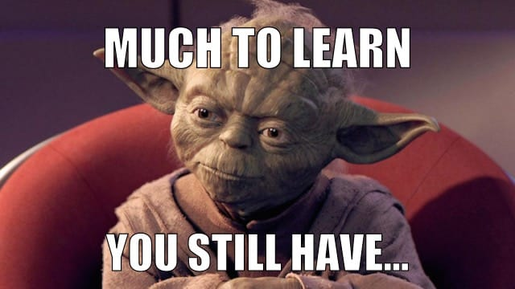
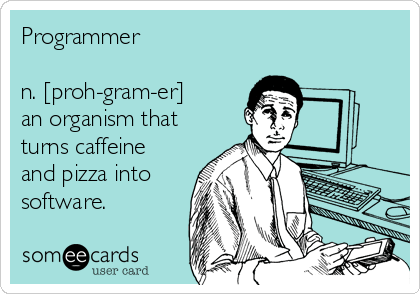

*This is a book review for [Soft Skills: The software developer's life manual](https://www.amazon.com/Soft-Skills-software-developers-manual/dp/1617292397).*

Everybody has read a decent amount of books about technical subjects, like programming languages, design patterns, best practices, etc. This is no different for me, which eventually led to a feeling which I can best describe as hitting some sort of ceiling. I've been a software engineer for about 15 years now and have been focusing on getting better at programming for most of this time. Don't get me wrong, I don't know everything about the languages I use, I don't know all the principles or patterns by heart, but I usually know how to find the things I need. I think this all got me thinking that if I want to grow a little in this area I'd have to deep dive some advanced areas, which means investing a lot of time. Sort of like the remaining part of the 80/20 rule.

So I was pleasantly surprised when this book crossed my path on a list of books that were suggested by a fellow software engineer. It pictured me the image that I'd probably liked coding and had that area covered, but what about the remaining part of the life as a software engineer? I say the remaining part of the life with a reason, since a lot of books focus on areas like talking to clients or job interviews, but this book promises to look at a whole facet of things in the life of a software engineer, besides coding. So I've started reading last month and now I'd love to share with you my opinion about this book.

## Conclusion
Starting with the conclusion? Am I insane? Not at all, I'm going to give you my honest opinion about the book, so you can decide for yourself if it's interesting enough. If you still want more, than you can read my deep dive through the chapters. I'd rather you spent the time reading a good book than a review, so just decide for yourself how far you'll read.

When you read the book you'll feel that John Sonmez's intent is to share his years of experience in life with you. He looks at things like dealing with clients, peers and managers, but also at finding love, finances, productivity and staying in shape. The chapters are divided into 7 major sections which I will handle further on. The writing style is easy to read, the chapters are really small which allows for quickly reading one when you have 15 minutes or half an hour to spare. It's full of practical examples, personal stories and assignments to help you get started to bettering your life. When you've read more books about the same subjects, you'll notice a lot of similarity between popular techniques, but in a more simple and practical way. A lot of it feels very familiar, while some of the area's feel only unusable unless you live in the United States or a country where culture and finances are similar. And some chapters depend on where you are in your career for them to be useful, but again, most parts are really good, I think about 70% of the books is in some way applicable to most software engineers. My conclusion, this is a must read for any software developer, I'd even put it in line with books like Clean Code and Design Patterns, this stuff is too important in your life not to think about. My rating 4.5 out of 5 stars.

## Section 1: Career
John focuses on your career. A must read for not just beginning software engineers, but any engineer in the business. It looks at subject like figuring out your goal in life and career, people skills and job interviews. But also things like employment choices, have you ever though about starting your own business? Or how about looking to get higher up the ladder? He looks at practical things like working remotely and fighting boredom. The two things that I love the most about this section is his chapter on "Fake it till you make it", the counter balance to the ever more appearing impostor syndrome, which I'll probably write a blog on at a later moment. The other chapter I really love was his closing one called "Don't get religious about technology". The title says it all. Stop arguing that Mac is better then windows, or C# beats C++ any day of the week, embrace technology and don't judge what you don't know, if it's widely used it's probably good if not great. There is only one thing I can say about this, and that's **amen!**

## Section 2: Marketing yourself
This section covers your own branding. See yourself more as offering a service and not as a employee. You'll read about building your brand, why this is important, and mostly on how to build this. He covers subject like writing a blog, which actually is what got me started writing on dev.to. But not only writing, he goes on to creating a successful blog, adding value, using social networks. And the more advanced stuff in speaking, presenting, giving training and writing books and articles. For me the best chapter in this section is again his last one, he really loves to close with the good one. In this case it's called "Don't be afraid to look like an idiot", looking at confidence growing one uncomfortable step at a time.

## Section 3: Learning
I can be really short about this one. John developed a 10 step learning program for himself that works really good. It looks at the big picture, but also helps you taking steps, getting progress and preventing the feeling of getting overwhelmed. The most inspiring part of the book was in this section for me, "Teaching: Learn you want? Teach you must." The last step of his 10 step program is teaching to others, a logical and clear step that never sunk in until I actually read it. Maybe it was the picture of Yoda he created, or he just had a great vision on this, either way this section got me exited and without hesitation I joined the [dev.to](https://dev.to/) mentorship program to teach, and learn from it.

## Section 4: Productivity
There are millions of articles about this subject and to be honest the things John writes about are nothing new. However, they are easy to understand and applicable, which really makes a difference. Think about keeping focus, the [Pomodoro technique](https://francescocirillo.com/pages/pomodoro-technique) and multitasking. Be he also talks about the dangers of burning out, which is a big issue in our industry. Lastly he handles subjects like wasting time, building habits and how to get and stay going. This is not my favorite section of the book, must of the stuff was already in the back of my head, but still it was great to look at it from his practical view and personal experience.

## Section 5: Financial
Here he looks with you at your earnings, which he tries to help you increase and at your spending. There are really personal stories about investing in here and more advanced stuff if you are interested. He talks about different kind of investments and the dangers of debts and ends with a great personal life story of his retirement at the age of 33. This was my least favorite chapter, mostly because the way his career took of when he was young and the investments he made are just not realistic in the country where I live. It's pretty limited how much you can invest in real estate the way he did and also the starting salaries like silicon valley are just now available around here. Although I really love his openness in this section.

## Section 6: Fitness
How many software engineers really pay good attention to their health? I know it's a stereotype that we live on coffee and pizza, but there is some truth in there. This section focuses on getting you healthy. John used to be a body builder when he was young and still is in very good shape. This makes it relatively easy for him to give you good advice on eating healthy, exercise and even the gadgets that will help you in getting there. There is not much I can say about this, he is right and we need to read about this.

## Section 7: Spirit
The closing section of the book handles the spirit, without becoming to spiritual. Which I love, he keeps his practical view and still talks about the things in our mind, spirit and soul. Think about the influence of your mind, your mental health and your self-image. Even the subject of finding true love is handled as is failure and the books that helped John gain his success. A great way to end the book, although I think there could have been a little bit more in this section.

## Hold on, there is more
I'm not talking the assignments, which you should really do. I'm talking about simple programmer. John not only talks about branding and building a successful blog, he talks from experience, so he really has one. His [simple programmer blog](https://simpleprogrammer.com/) is a really great addition to this book and made my daily must read list. Besides these blogs, he has a [YouTube channel](https://www.youtube.com/user/jsonmez) which I can really recommend, covering a lot of sections from the book in greater details as well as things that aren't in there. Last but not least, he even offers paid services helping you excel at the subjects handled in the book. I have no experience with the latter, but looking at his free stuff, this is probably great as well!

