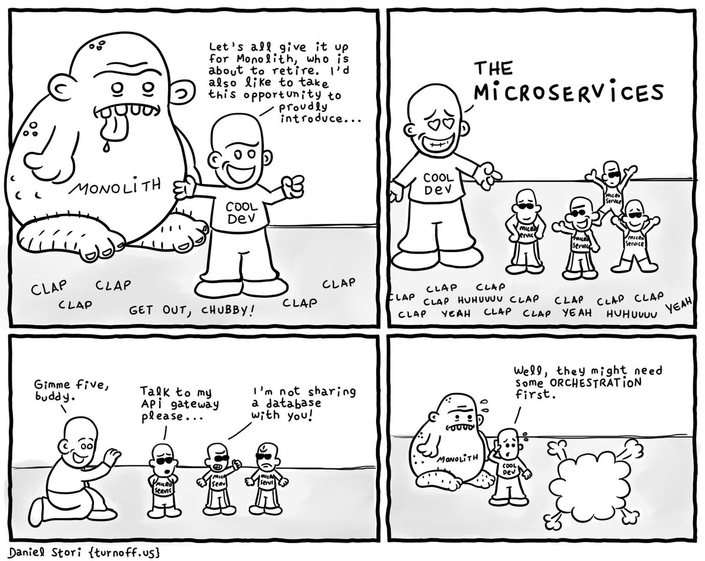

*This is a book review for [Building Evolutionary Architectures: Support Constant Change](https://www.amazon.com/Building-Evolutionary-Architectures-Support-Constant/dp/1491986360/).*

A while ago I attended a basic talk about micro-services. While covering most of the basics of this architecture, somewhere near the end the speaker mentioned the term 'Evolutionary architecture'. Unfortunately he was only able to mention that he thought this was an important topic, but there was no time to talk about the actual content of it that day. A little bumped out by this, I was still really exited about the subject. I've never been a big fan of the traditional architect role. In my opinion architectures should be formed, evolved if you will, by a collaboration of the teams working on it. You see where my excitement came from? You see that little word in there, staring right into your soul? Evolved... And now hearing someone saying the term evolutionary architecture, this has to be the same thing right? Right? I'm so ready for this idea of biblical proportions now, so I decided to read the book "Building Evolutionary Architectures".

## Conclusion
Just like my previous reviews and probably the ones to follow, I start of with the review. If I've sparked your interest, please keep reading on into my deep dive. If not, at least you know what I think of the book.

After closing the book I had some mixed feelings. The first half of the book kind of dragged on, but it got somewhat more practical in the second part. It didn't align with my vision, well maybe it did. The book has been written with the traditional architect role in mind and focuses on the way he or she can and should evolve their architecture. The most important part to accomplish this is defining the key characteristics (or -ilities) of your product and architecture. Make sure you have, preferably automated, ways of validating your system against these characteristics and adjusting them when needed. The first half of the book covers this in a deep theoretic way, talking about choosing you characteristics, considering evolvability as one of them and how to use them. The second part of the book goes more into practical things. Things like monoliths, micro-services, incremental changes and agile are all talked about. This part felt somewhat more useful to me. Throughout they use a widget company as example, which makes it a lot easier to comprehend in practice. Lastly it was a pretty short book, coming in at almost 170 pages, it's a lot shorter then most books I read. All in all I give this book a 7 out of 10, because the core of their evolutionary architecture view is a pretty good one.

Ready for a deep dive? I'll walk through the main chapters and talk about what stuck with me the most.

## Chapter 1. Evolutionary architecture
It's common nowadays to hear that you shouldn't make any 5 year plans when creating software, the markets and industries are just too fast for this. While it worked, or at least most of it did it this way, in the past, now we benefit more in working in an agile way. This translates to software architecture as well, it's insane to think that you'll think of an architecture today that will suffice you for the next 3-5 or even more years. You should think a lot more short term, but make sure you can evolve your architecture. Changes to the technical landscapes will happen during the course of your product, and you should be able to handle them. Although architecture is defined a lot of the times as the "hard to change" parts of the software, this doesn't have to be the case as long as you make evolvability one of your key characteristics. This gives us evolutionary architecture: "An evolutionary architecture supports guided, incremental changes across multiple dimensions".

Guided is one of the most important parts of this definition. We need a way to safe guard the important characteristics of the architecture over time. And keep in mind, as the system grows, the number of characteristics that are important usually grow with it. The other key in the definition is incremental, you should be able to make changes to your architecture.

## Chapter 2. Fitness functions
An architectural fitness functions allow you to assess if your system still meets the characteristics you defined as important. These means give you guidance, this is what separates evolutionary architecture from reactionary architecture. Reactionary would be responding to problems, like performance issues, not being able to scale or having a security leak when they are an actual problem. Evolutionary architecture makes you define them up front and safeguard them. One interesting development method for this mentioned in this chapter is Monitoring-drive development. Using monitors in production environment to asses both technical and business health. There is an obvious preference to automate the fitness functions, so it's easy to run them. A risk that is talked about is when you don't define the architecture characteristics up front, you will eventually have the responsibilities scattered throughout your whole code base, making a any impact analysis to understand a change a challenging operation.

## Chapter 3. Engineering incremental change
Any reasonable architecture plan must include evolutionary change, without it you are doomed to get stuck. The definition and maintenance of fitness functions is a shared responsibility between developers and architects. Many things about architecture are testable, and there are a lot of tools for this (e.g. JDepend and NDepend). Other supporting libraries mentioned are Chaos Monkey, Similan Army and Conformity Monkey as ways to create holistic fitness tests. Chaos monkey for example randomly takes services down and assess the systems ability to deal with it. And Conformity Monkey assesses best practices on RESTful APIs.

## Chapter 4. Architectural coupling
Discussions about architecture frequently boil down to coupling: how the pieces of the architecture connect and rely on one another. Many architects decry coupling as a necessary evil, but it’s difficult to build complex software without relying on (and coupling with) other components. Evolutionary architecture focuses on appropriate coupling — how to identify which dimensions of the architecture should be coupled to provide maximum benefit with minimal overhead and cost. Bounded context are a very useful way to prevent tight coupling and micro-services is an architecture that is very suitable to apply this. This architecture is designed to allow incremental changes, making it very suitable for evolvability. Regardless of which architecture pattern you chose, defining the quantum size is advised. Or in layman's terms, what goes into a part of the system. Small quanta implies faster changes. Several architectures are discussed, among them:

###Layered architecture monolith 
Developers find it easy to make changes in this architecture, although cross-layered changes require some coordination. Writing fitness function is considered easy as well, because the structure in this monolith is more transparent and the coupling is pretty easy to overview and maintain.

###Modular monoliths
Many of the benefit architects see in micro-services - isolation, independence, small unit of change - can be achieved in monolithic architectures. If developers are very disciplined about coupling. Which can me guarded with fitness functions. It's as easy to change and write fitness functions for as in layered architecture, with the benefits of having appropriate coupling.

Both monolithic architectures are a common choice when starting a project because it's easy to understand. Eventually you might need to evolve into another architecture, which nowadays usually will be into micro-services. But keep in mind, if a development team has a hard time building one of the simplest architectures, how will moving to a more complex architecture solve their problems? 

###Micro-services
If you can successfully pull of micro-services, it is the most suitable architecture for evolvability. You can evolve per service, as long as you keep the communication between services intact.

###Service-based architectures
A more commonly used architectural style for migration is a service-based architecture, which is similar to but differs from microservices in three important ways: service granularity, database scope, and integration middleware. Service-based architectures are still domain-centric but address some challenges developers face when restructuring existing applications toward more evolutionary architectures. For example the database is usually monolithic, since for many applications it isn't feasible or possible to restructure years of database schemas.

## Chapter 5. Evolutionary Data
How can architects build systems that support evolution but still use traditional tools like relational databases? The key to evolving database design lies in evolving schemas alongside code. Continuous Delivery addresses the problem of how to fit the traditional data silo into the continuous feedback loop of modern software projects. Developers must treat changes to database structure the same way they treat source code: tested,
versioned, and incremental. The level of granularity is also important. Architects sometimes try to build an architecture with a smaller level of granularity than is natural for the business. For example, micro-services architectures aren’t particularly well suited for heavily transactional systems because the goal service quantum is so small. Service-based architectures tend to work better because of less strict quantum size requirements. Also we should consider the coupling characteristics of our application: classes, package/namespace, library and framework, data schemas, and transactional contexts. Ignoring any of these dimensions (or their interactions) creates problems when trying to evolve an architecture. 

While systems often cannot avoid transactions, we should try to limit transactional contexts as much as possible because they form a tight coupling knot, hampering the ability to change components or services without affecting others. More importantly, we should take aspects like transactional boundaries into account when thinking about architectural changes. When migrating a monolithic architectural style to a more granular one, start with a small number of larger services first. When building a greenfield micro-services architecture, developers should be diligent about restricting the size of service and data contexts. However, don’t take the name micro-services too literally — each service doesn’t have to be small, but rather capture a useful bounded context.

## Chapter 6. Building evolvable architectures
We can use these techniques for building an evolutionary architecture in three steps: 

1. Identify Dimensions 
We must identify which dimensions of the architecture we want to protect as it evolves. This always includes technical architecture, and usually things like data design, security, scalability, and the other “-ilities” we have deemed important. This must involve other interested teams within the organization, including business, operations, security, and other affected parties. 

2. Define Fitness Function(s) for Each Dimension 
A single dimension often contains numerous fitness functions. For example, we commonly wire a collection of code metrics into the deployment pipeline to ensure architectural characteristics of the code base, such as preventing component dependency cycles. 

3. Use Deployment Pipelines to Automate Fitness Functions 
Lastly, we must encourage incremental change on the project, defining stages in a deployment pipeline to apply fitness functions and managing deployment practices like machine provisioning, testing, and other DevOps concerns. Incremental change is the engine of evolutionary architecture, allowing aggressive verification of fitness functions via deployment pipelines and a high degree of automation to make mundane tasks like deployment invisible. Part of the responsibility of developers on projects that support evolutionary architecture is to maintain good cycle time. Cycle time is an important aspect of incremental change because many other metrics derive from it. For example, the velocity of new generations appearing in an architecture is proportional to its cycle time. In other words, if a project’s cycle time lengthens, it slows down how fast the project can deliver new generations, which affects evolvability.

While this advice seems obvious, we constantly see teams that have chosen the shiniest new architectural pattern rather than the most appropriate one suffer. Part of choosing an architecture lies in understanding where the problem and physical architecture come together. We must understand why we want to perform a migration, and it must be a better reason than “it’s the current trend.” Splitting the architecture into domains, along with better team structure and operational isolation, allows for easier incremental change, one of the building blocks of evolutionary architecture, because the focus of work matches the physical work artifacts. When decomposing a monolithic architecture, finding the correct service granularity is key. Creating large services alleviates problems like transactional contexts and orchestration, but does little to break the monolith into smaller pieces. Too-fine-grained components lead to too much orchestration, communication overhead, and interdependency between components.

They dive a lot deeper into developing a evolutionary architecture, talking about making you decisions reversible, be aware that you don't know what the future will bring, be aware of the risk of data corruption and stay away from the pitfall of shoving everything into technical debt. Last but not least, do not underestimate the power of prototyping and do not be afraid to throw it away afterwards!

## Chapter 7. Evolutionary Architecture Pitfalls and Anti-patterns
This chapter dives into several anti-patterns and pitfalls. I won't go into them all but to name a few that caught my attention:

Code reuse abuse
Ironically, the more effort developers put into making code reusable the harder it is to use. Making code reusable involves adding additional options and decision points to accommodate the different uses. The more developers add hooks to enable re-usability the more they harm the basic usability of the code. In other words, ease of code use is often inversely proportional to how reusable that code is. When developers build code to be reusable, they must add features to accommodate the myriad ways developers will will eventually use the code. All that future-proofing makes it more difficult for developers to use the code for a single purpose. That doesn't mean you should avoid reuse of code, but you should continually evaluate if you still need it and not be afraid to break the links when it's better.

Planning Horizon
More and more effort put into the assumptions, even if they turn out to be false in six months, leads to a strong attachment to them.  Put simply, the more someone invests time or effort into something, the harder it becomes to abandon it. In software, this is seen in the form of the irrational artifact attachment.

## Chapter 8. Putting Evolutionary Architecture into Practice
Teams structured around domains rather than technical capabilities have several advantages when it comes to evolutionary architecture and exhibit some common characteristics. Domain-centric teams tend to be cross-functional, meaning every project role is covered by someone on the project. The goal of a domain-centric team is to eliminate operational friction. In other words, the team has all the roles needed to design, implement, and deploy their service, including traditionally separate roles like operations.

By modeling architecture and teams around the domain, the common unit of change is now handled within the same team, reducing artificial friction. A domain-centric architecture may still use layered architecture for its other benefits, such as separation of concerns. For example, the implementation of a particular micro-service 
might depend on a framework that implements the layered architecture, allowing that team to easily swap out a technical layer. Micro-services encapsulate the technical architecture inside the domain, inverting the traditional relationship.

Another useful procedure is shifting from a project to a product mentality, as it really increases involvement. Product teams take ownership responsibility for the long-term quality of their product. Thus, developers take ownership of quality metrics and pay more attention to defects. This perspective also helps provide a long-term vision to the team. Also keep you teams small, big teams tend to have more problems and don't work together as well.

Try and apply the three strikes and refactor rule. The first time you do something, just do it. The second time, wince at the duplication but do it anyway. The third time you do something similar, refactor. And don't be afraid to experiment, try out new ideas so you keep growing.

##Final Thoughts
They talk about a lot of stuff. Most of it isn't new, it was just applied to architecture and connected into the concept that is called "Evolutionary architecture". These are good concepts, and as developers we should really be aware of this stuff when developing and designing our projects. In the end it all boils down to creating awareness in these areas, don't just chase the new shiny diamonds of which there are a lot in our industry, but make a conscious and well considered choice when building your software. 

