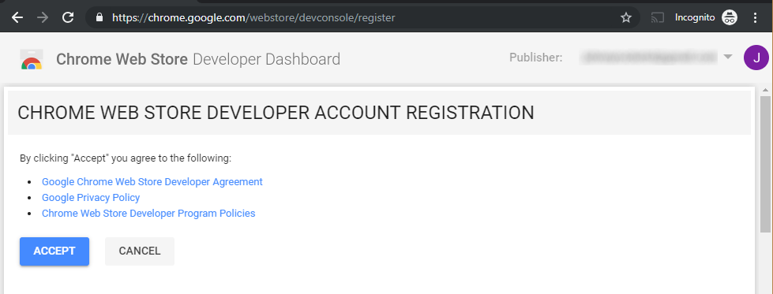

Recently I've created my first chrome extension. It's called [Catify](https://chrome.google.com/webstore/detail/ihjgbjdkgnploojjhjepdaigkoigianp/publish-accepted?authuser=0&hl=en-US), and it replaces every image on your page with an image of a cat. Now every cat worshiper can get even more support while praying to his or her cat gods. It was my first attempt at a Chrome extension and it was a fun journey. Would you like to create your own Chrome extension as well? Awesome, I'm going to show you how. Let's build it together, so put on your hobbit feet and loudly shout "I'm going on an adventure!". And don't worry, you'll be done before second breakfast. 

## What are Chrome extensions
Although Chrome is a great browser on its own, you can make it even better. By adding extensions to it. To check which extensions are available you can go to the [Chrome Web Store](https://chrome.google.com/webstore/category/extensions). Just go and check out all the amazing extensions available. And now imagine your own extension in that store as well. Let's make that happen.

## What are we building?
While you probably already have dozens of ideas of great extensions to build, we should take a look at the basics first. So for our first extension we'll take one of the basic examples from Google themselves, page redder, and we spice it up a little. We'll create an extension that turns the background color of the page to a random color every time you press the extension icon.

## Getting started, create the manifest
Make sure you set up your source control and have your favorite editor pointed to the right location. We start by creating a manifest, this is the file that tells Chrome everything it needs to know about your extension. Things like the name, the icon, but also which permission it requires and where its code is located. Let's create one, create a new file called `manifest.json` and fill it with the following:

```json
{
  "name": "Make it rain(bow)",
  "description": "Embrace the inner unicorn and reflect on the page background.",
  "version": "0.0.1",
  "manifest_version": 2
}
```
So, what do we see here? Firstly the `name`. This is how the extension gets shown in the store, in the extension overview and unless specified otherwise what you get to see when you hover the icon inside the browser. Then there is `description`, this is just like the title, a description shown in the store and the extension overview. Followed by the `version` of your extension. You should use semantic versioning on your extension and increase this every time you update your extension. Lastly we see `manifest_version`, this tells Chrome this file is written in manifest version 2. Should you want to support Chrome before version 18, you should use manifest version 1, but you'll lose some of the newer functionality. Now that the basics are in place, we can slowly add more stuff.

## Change the title when hovering the icon
By default it shows the name of the extension, but it doesn't have to be the same. Let's change it! Add the following to the root of your `manifest.json`.

```json
"browser_action": {
  "default_title": "Unleash the unicorn dust!"
},
```
Now when the user hovers the icon, it will show the text `Unleash the unicorn dust!`.

## Permissions and the script
Before we can build the actual code for the extension, we need to add two more things to the manifest. Firstly, we need to define the permissions it needs to have. In this case we only need one permission, which is access to the current tab. Let's define this. Add the following to the root of your `manifest.json`.

```json
"permissions": [
  "activeTab"
],
```
Next we need some script to run which performs the actual changing of the background. We will be performing this in a background script, which we need to define in the `manifest.json` as well. Add this to the root.

```json
"background": {
  "scripts": ["background.js"],
  "persistent": false
},
```
So we will define our logic in a file called `background.js`. Next to that it will not be persistence, you should only make it persistent if the extension uses chrome.webRequest API to block or modify network request. Time to build the actual logic!

## Changing the page background color
Okay, so we told Chrome that the logic is placed in `background.js`, so let's make this file and build the logic.

```javascript
chrome.browserAction.onClicked.addListener(function(tab) {
  const colors = ['red', 'orange', 'yellow', 'green', 'blue', 'violet'];

  const colorPicker = () => {
    const randomIndex = Math.floor(Math.random() * colors.length);
    return colors[randomIndex];
  }

  chrome.tabs.executeScript({
    code: 'document.body.style.backgroundColor="' + colorPicker() + '"',
  });
});
});


```
Let's take a short look at the code. The first line tells us that we added a listener to the onClick event of the browserAction. What, what, what?!? The browserAction is the button you see in chrome when you add an extension, the onClick is the event that happens when you click that button and adding a listener means this triggers when that click action is performed. So this method is executed when you click the button inside chrome. 

The code itself isn't that exiting. We have a list of colors, a method that picks a random color from that list and a script execution that changes the background color. We do this by executing a piece of javascript inside the browser tab that performs this action inside the actual page.

## Add an icon
Before we are going to try out our extension, we'll give it something nice to look at. We are going to define the icon that is shown in the top of your browser for this extension. Start by creating any 128x128 image you want. Now you'll want to save this image into several formats:
- 128x128, which is used in the chrome store
- 48x48, which is used during installation
- 32x32, which is often used by windows
- 16x16, which is used in chrome itself as the icon that is shown at the top of your screen.

To add these images, we change the following in our `manifest.json`. Add this to the `browser_action` section:

```json
"default_icon": "icon16.png"
```
We only need to specify the 16x16 image here, since that icon is always 16x16 on any device. And add this piece to the root:

```json
"icons": { 
  "16": "icon16.png",
  "32": "icon32.png",
  "48": "icon48.png",
  "128": "icon128.png" 
},
```
These are the icons that can be used from your applications and which have all the required sizes available.

## Lets try it out!
Are you excited? You should be, because we are going to test our extension in our own browser! Fire up your chrome and go to your extensions by pressing the menu button and choosing **More Tools** > **Extensions**. The first thing you should do is enable developer mode. You find this in the top right corner. Enable this.


Now you should see three buttons appear in the top left of your page. Allowing you to load an unpacked extension, pack an extension or force updates. Click on the first button, to load an unpacked extension.


Now browse to the folder where you've create the extension and press `Select folder`. Your extension will be installed now, how exciting! After it's installed you should see it on your extension page and at the top of your browser.


Lets try it out! Open a new tab, go to dev.to and press the rainbow icon. And press it again...and again...and again...taste the rainbow!


It works!


## Publishing your extension

There is only one thing left to do, and that is publishing your amazing `Make it rain(bow)` extension. Let's walk through the steps.

- Create a zip file that contains all the files you've made. So the `manifest.json`, the `background.js` and all the icons should be in there.
- Go to https://chrome.google.com/webstore/devconsole/ and sign in with your google account. 



After you accept the licenses you can continue with your extension.
- Press the button that says `NEW ITEM` in the top right, which opens a dialog where you should chose the .zip file you created in step 1.


- After uploading a form will open which requires some details before you can make your extension available. You will at least need to fill out:
  * Title
  * Summary
  * Detailed description
  * Category
  * Language
  * One screenshot
So let's fill these out.


- Press the 'SAVE DRAFT' and if everything is filled out correctly you should now be able to press 'PUBLISH ITEM'. Click it, now only a confirmation awaits. While you search your inner unicorn you feel your stomach growling for second breakfast, so you quickly press `PUBLISH` and your adventure is done. You just finished your first extension!


## Finishing up
Thank you for joining me on this adventure, I hope you learned something from it. As you can see, creating a Chrome extension isn't that hard. Coming up with a good idea for an extension that isn't available yet, that's a whole different story. I can only wish you good luck and hope to see one of your extensions very soon!

## Resources 
While there is a lot to find on the internet about extensions, I mainly used the google documentation as it is very clear and complete. There are also a lot of working examples in there:

https://developer.chrome.com/extensions

And you can find the example code used here:
https://github.com/JHotterbeekx/make-it-rainbow-chrome-extension