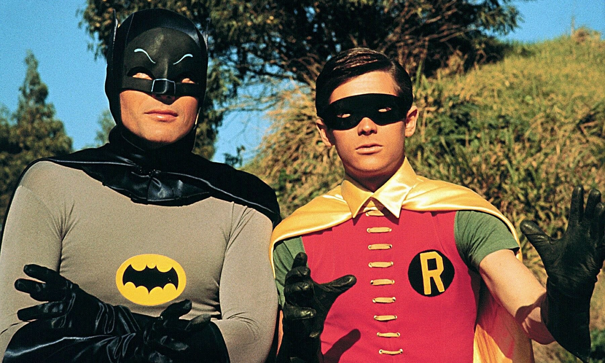

I'd love to introduce you to the team I've proudly been a part of for the last three years. We've had our shares of ups and downs working together. Streamlining our processes to increase not only the amount of work we get done, but also the quality of the it. Learning what to do, and of course what not to do. If you are interested, sit down, strap yourself to your seat and join me while I take you through the journey of team Heisenberg.

## Who are we?
Three years ago a restructuring within our product and engineering department put a group of six people together. We came from all corners of the world, well sort of, if you consider the floor of our building a world, which it basically is because working on a software department is a world on it's own. Anyway, most of us were already working for the company when we formed the team, but we had some new people as well. 

The team consists of Mike, our product owner. Who's been fighting to get the features built that need to be built, define a clear road map and vision for our products and most importantly making sure that the level of jokes being told are as low as they can possibly be. We also had Niels, our scrum master. Not only teaching us to work agile using scrum, but also taking us on a mentoring journey to increase the quality of the products that we build and increasing the quality of the team at the same time. And last but not least there are four software engineers. All of us making sure things were built in the right way, making sure everything keeps working as expected and making sure our product owners emotions kept tightly strapped in the roller coaster we put them in. 

As all developers do, we all have quirks of our own. Take Johan who keeps trying to convince everybody that we have to speak Dutch, or Jo who is a Belgium guy with a love for BBQ, weapons and bad movies. It is like having your own cross-over between Chuck Norris and [Jo Bonten](https://www.youtube.com/user/jobontenofficial) in your team. Our third developer started of with our good friend Bert, who was so fond of telling us to add comments saying arrange, act and assert to every test or that we had to remove unused usings in our C# files, that even after having left the company two years ago we still refer to these things as Bertjes. Nowadays his place has been taken by our Brazilian friend Geraldo, who's awesome logic sense to simplify chances of anything happening to 50/50 is always great to have around. Lastly there is myself, I'm not going to praise myself here, but if you'd stop by there are probably enough weird things my team mates can tell you about me. This band of misfits is us, team Heisenberg.

But why Heisenberg you might be wondering. Well starting a new team should always start with the best thing you'll ever do...coming up with a name. I remember we wrote a whole list of names down. TV Shows, childhood cartoons, a lot of names with the word `code` in it. Slowly reducing them to just a few and eventually voting for Heisenberg. Of course thinking of the somewhat famous German physicist [Werner Karl Heisenberg](https://en.wikipedia.org/wiki/Werner_Heisenberg)... well not really, we all just loved the TV show. I mean come one, how awesome is it to say "I am the one who knocks" when entering a room? And next to that having a name that's almost the same as the feared [Heisenbug](https://en.wikipedia.org/wiki/Heisenbug), we couldn't get more awesome than this, right?

## Full stack and more
While I hear different ways software engineers define roles in their teams, we've found our own way in this. Since the beginning our agreement has been that every engineer in our team should be able to do everything we need to build and maintain our products. You might not be great at it, but you should understand the basics and be able to work with it. While the basics of this knowledge is our full stack, meaning our React front-end and our C# back-end, we go further than that. We all write our own tests, monitor our running products, maintain our infrastructure in the cloud, maintain our CI/CD pipelines, do our designing basically, manage our databases, run our data warehouse, anything that is part of building our product. And in the last year, after our scrum master left the team, we've also started rotating the role of scrum master between team members every week. While it is a lot of work in keeping up with the everything, this way of working gives us great advantages in swarming stories and reducing dependencies on each other. At this point any three developers can go on holiday and the fourth one is able to take care of everything he needs to.

## How do we work?
We've been doing agile scrum since the start of the team. This means we do all the regular scrum stuff like stand-ups, sprint reviews, sprint planning and retrospectives. We work with stories, a backlog and sprints. But it get's more interesting as we dive into how we handle these stories.

The first thing we do when starting a story is a 'Design Discussion'. This is where all the engineers gather up and discuss how exactly we are going to build it. This usually ends up in several, pretty detailed tasks, which helps us in swarming the story. In the design discussion we also think about which end-to-end, monitoring and data-validation tests might need to be added, all other tests are part of the regular tasks. Next up we make something that we call a 'Test Plan'. One of us makes a mind-map with everything we want to manually test for the story, to make sure it works. While most of it is covered with automated tests we keep doing this step because even though automating tests is great, nothing is better to give you a good final overview of the workings of a feature as manual testing. You can compare it with exploratory testing, but with some guidance. This plan is then looked at by a second person who adds more steps if possible while reviewing it.

This takes us to the tasks which are always handled twice. One person picks it up, by putting his initial on it and once done, which includes writing all tests for it, checks it off. Then another person picks the same tasks and reviews everything the other person did. So no task is completed unless two people looked at it.

### Architecture review
Once all tasks are done, including all tests, we have one task left. We call it the 'Architecture review'. We sit together with all developers from the team and go through everything we touched in the code. Now we pay extra attention to the way we named entities, the place we put them, dependencies between them. We discuss direction where we want to go with the code and structure. Usually this means we will change some things to make steps in the way we want to go. This keeps the architecture of our code in good health and gives us a point to regularly think about it.

Now we push our code to our test environment, let the automated tests run and pick up our test plan. At this point two different people use the test plan and manually perform and validate all the steps from our test plan on the test environment. Trying their best to find at least one issue, because a wise man once told us if you test good enough you should always be able to find at least one thing wrong. Once we developers agree the story is complete, we demo it to our product owner and if he signs off we push everything to production and drop our feature branches.

## Things we learned
When you work together as a team you keep adjusting the way you work to increase the quality and performance of the team. We've tried a lot, some things worked great, some of them didn't. I'd love to go over a few of them.

### Batman and Robin
Next to our function we have several roles in the team. You can be scrum master for that week, you can be designated to do the demo at the next sprint review, and lastly you can be either Batman or Robin...queue bat-music!

These roles are relatively new in our team, but work really well. So what's the deal with them you might ask. Well if you are Batman, the dark knight, the caped crusader, then it is your task to not only protect Gotham, but also to protect the flow of the team. You'll be doing this by taking care if any bug or other incident that comes in our path. And you won't be doing this alone, should you need help you can always count on your trusty sidekick Robin. Sounds awesome doesn't it? It is, and it really works!

If you work in a team you probably know that there are always interruptions. This can be bugs that are reported, import information requests that need to be handled, basically anything that wasn't planned in a sprint but can't wait until the next one. Our batman takes this task, should he need help he'll ask Robin. This makes sure the other two developers can stay in their flow. Once the task is taken care of, Batman retires and our Robin becomes Batman. He then picks a new Robin and they will stay guardian until the next issue arrives. This way it's divided between the whole team, most of the team does not get interrupted and you can be a cool superhero once in a while.

### Zero bug policy
Like every team we've had our fair share of struggles when it comes to bugs. Do you always give them priority over new features? How do you ensure they are found and fixed quickly? What can you do to reduce the chance on bugs?

For most question we follow the best practices. We pay attention to quality, build a lot of automated tests, do manual testing, have monitoring and more. But bugs can, will and should happen. If you don't have any bugs, you probably spent too much time making the code quality to high. Interesting opinion right? Maybe I'll write something about that one day. Anyway one of the things we do is maintain a our own version of a zero bug policy.

Most definitions of zero policies are pretty straight forward, if there is a known bug you fix it before you work on new features. While it sounds awesome, in real life this loses a little bit on the pragmatic side. This is how we came up with our version of the zero bug policy. Any found or reported bug will be investigated, assessed and discussed. Is the impact big enough it will become highest priority in our current sprint. Is the impact not that high, it will go on the backlog and will be highest priority in the next sprint. This means all bugs are usually solved within the time span of a sprint, which is two weeks for us. We find that this solution gives us the best balance between providing the quality we aim to achieve and the amount of disturbance in the work on new features.

### Work together
This one might sound simple and unnecessary to mention, but it isn't. I can't express how important it is to work together. Within everything in our team you can tell that we pay attention to this. We do our stand-ups, swarm our stories, have tasks like 'Design discussion' and 'Architecture reviews' where we all sit together. And like I mentioned before, every task is done by at least two people independent from each other so a lot of information is shared that way as well.

Next to this there is always a lot of talking going on in our office. Not everything is work related, but it keeps the lines open which is very important. Because now when somebody is stuck, has some doubts or anything else that could use some help it's relatively easy to just ask it out loudly in our room. I can not express enough how important it is to work on creating this atmosphere in your team. When you enter the room you should feel as a team, not an individual working in a team. When something breaks you should feel responsible, as a team. When you complete your sprint you should celebrate, as a team. Take lunches together, do fun stuff together, create a place where people aren't afraid to talk about stuff they're struggling with, be it work or personal related. That's when you know you've built a good team. That's what we've built in team Heisenberg.

### You are not your product
Another thing I've learned throughout the years. I've been in many teams, seen them come and go and usually a team was tied to a single product. Once the product was done or help in another product was needed you moved on. Slowly I've seen a transition making the link between a product and a team less and less. This made me realize that there is a really important difference between working with several people on a product and working in a team. A good team has their strength in working together, not working on a certain project. Can you have a single project? Yeah, sure. But it should not define your team. Don't be afraid to work on other projects, but work on them as a team. This is where you are at your best.

### Testing is hard
A little more technical than the other lessons, but like the title says testing is hard. And not just writing the tests can be a challenge, but thinking about what to tests, not testing to much, using TDD or not, naming your tests, keeping end-to-end tests stable, keeping tests up to date. And how about this one... not letting tests prevent easy refactoring while writing tests to allow easy refactoring... oh yes, I just said that...

I'd love to say that we've found the perfect solution for this, but I don't think there is any. At least not a perfect technical solution. The important tools you need are experience, communication and pragmatism. Experience; keep trying. You'll make too many tests, too little, name them wrong. But keep trying, the more you practice the better you'll get. Communication; keep talking with your team about it. Challenge each other, experiment, but do it together. Pragmatism; don't over do it. Don't spent 3 days writing tests for a feature that has zero impact when it breaks. Stay practical.

## Thank you
I'd like to end this article with a thank you towards the team. Thank you for letting me be part of the team, thank you for helping me grow, thank you for this amazing journey.